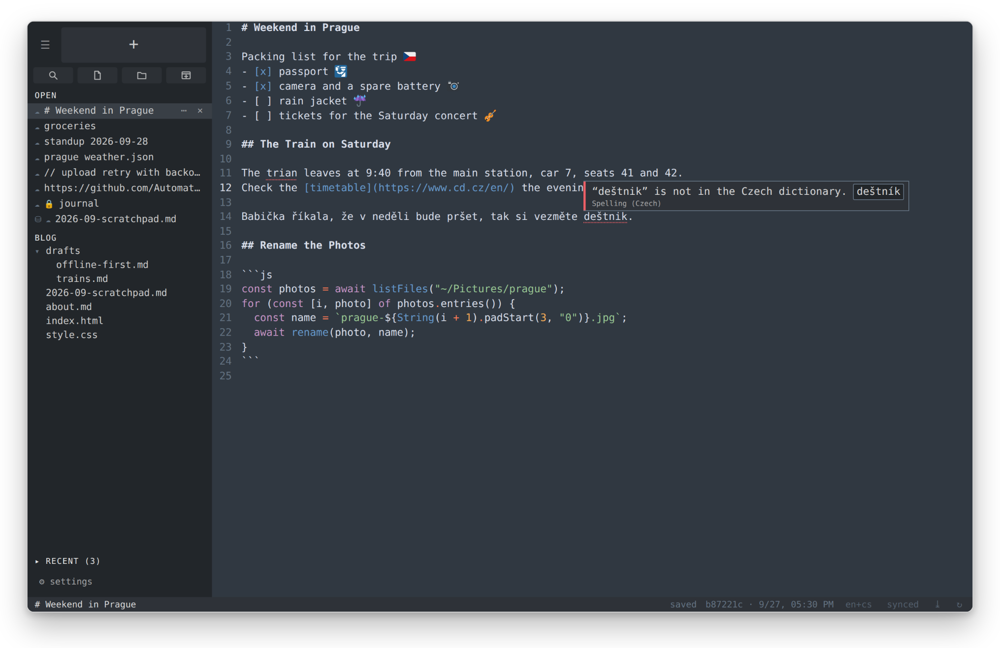
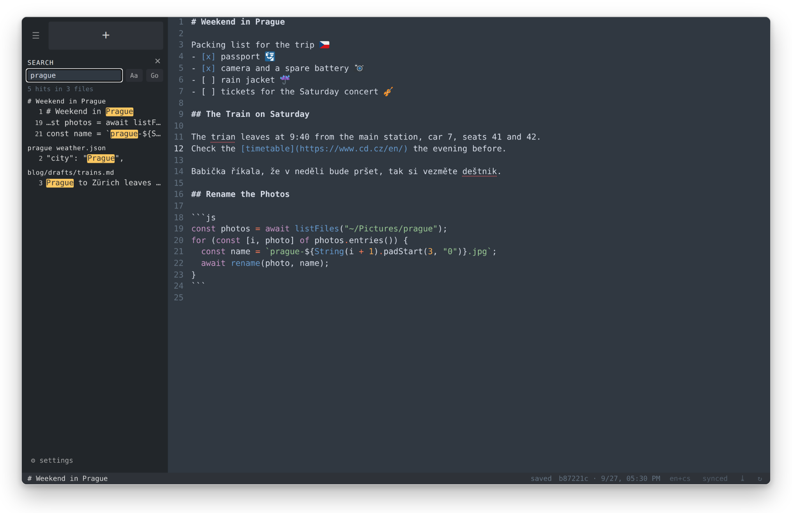
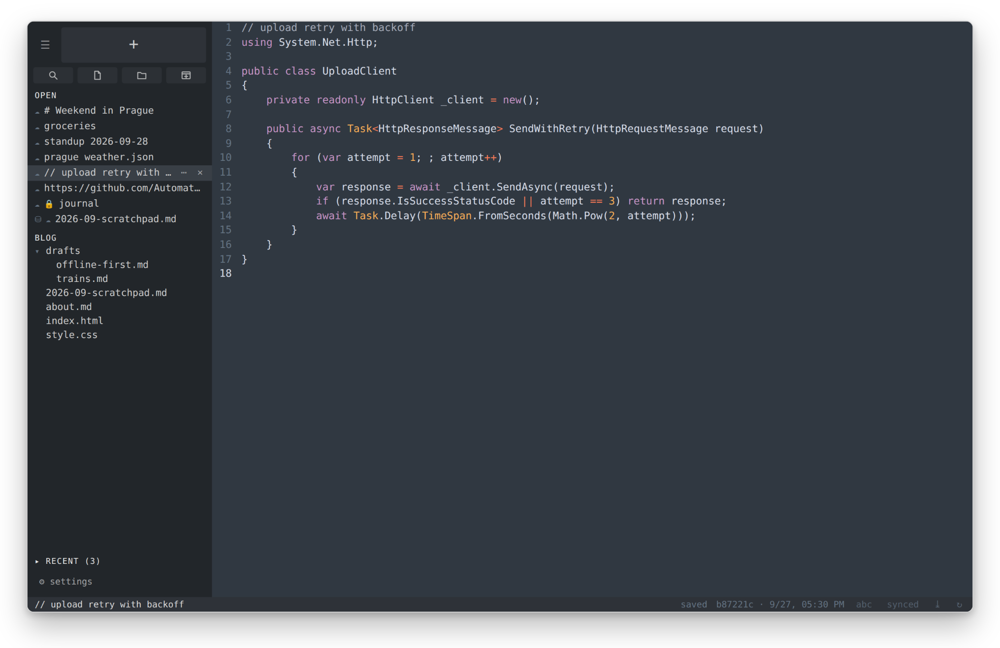
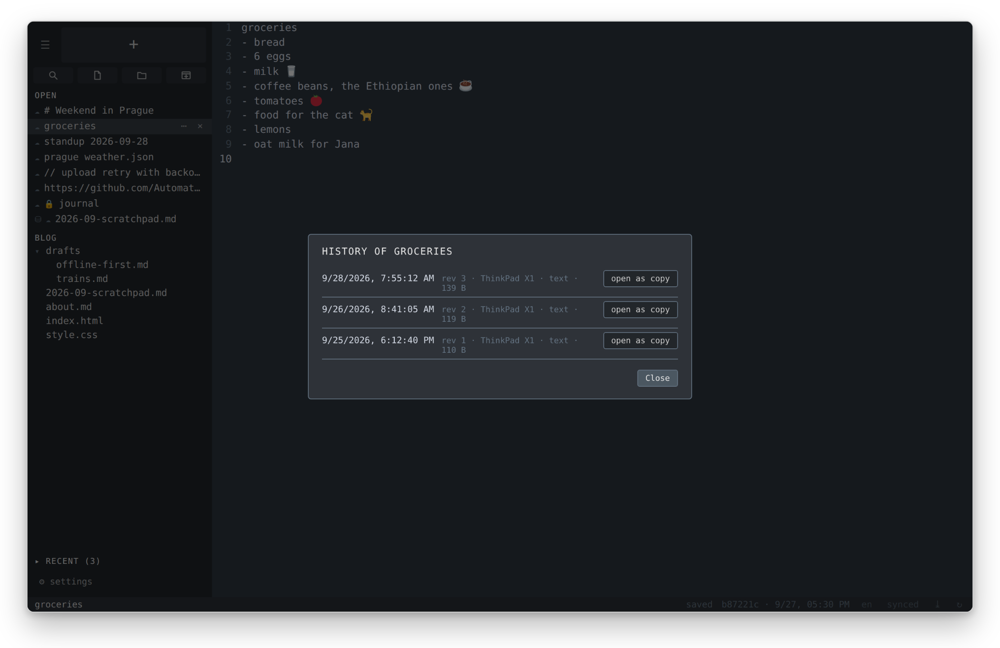
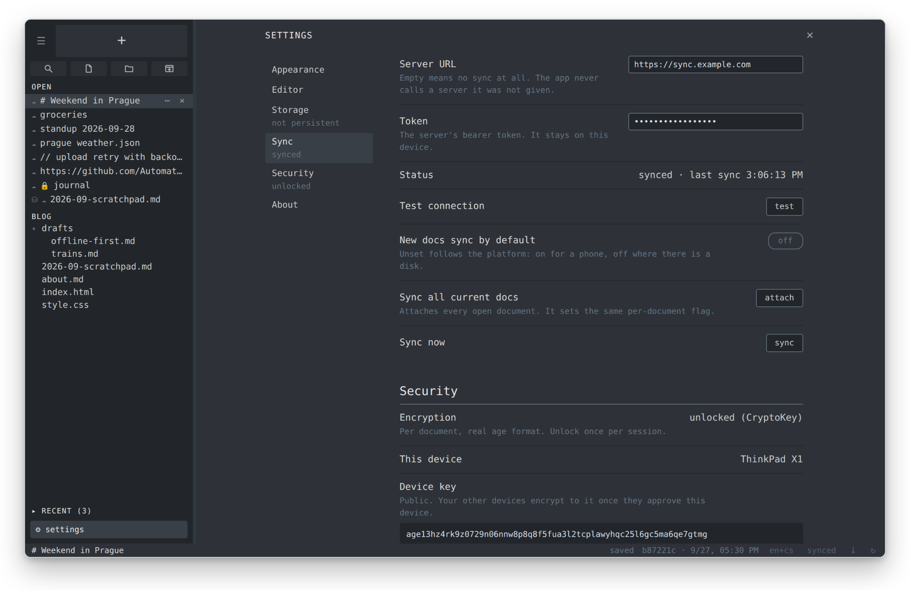
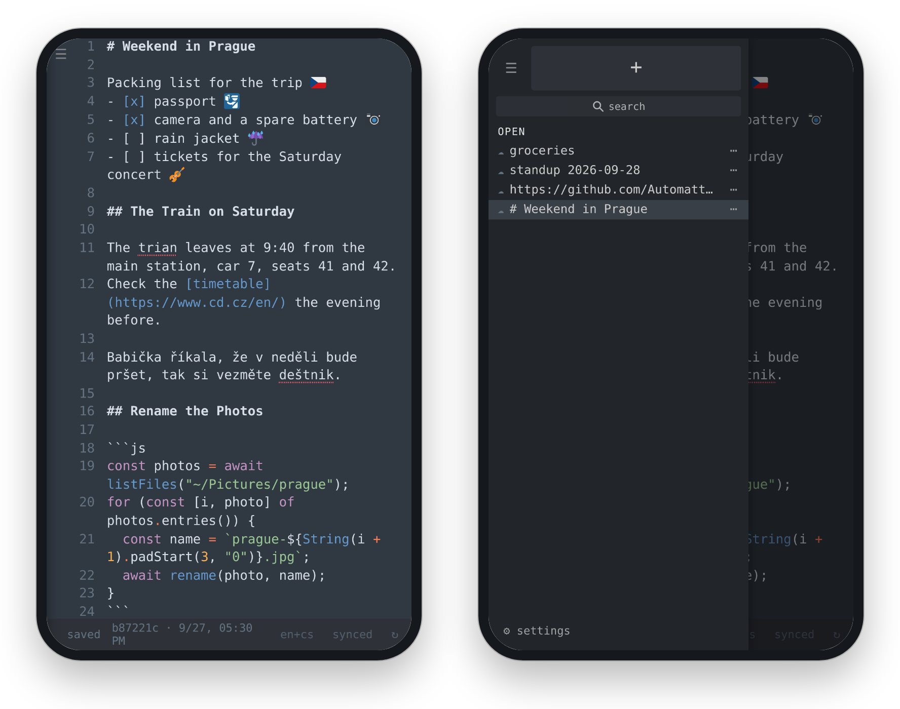

<p align="center">
  
</p>

<h1 align="center">vrtti</h1>

<p align="center">
  A scratchpad text editor in the spirit of Sublime Text.<br>
  Your notes survive a restart without a save, and closing a note never asks a question.<br>
  It runs in the browser, as an installed app on a desktop or a phone, and in a small desktop shell.
</p>

<p align="center">
  <a href="https://urza.github.io/editor/"><b>Open vrtti</b></a>
  &nbsp;·&nbsp;
  <a href="https://github.com/urza/editor/releases/tag/desktop-latest">Desktop builds</a>
  &nbsp;·&nbsp;
  <a href="server/README.md">Sync server</a>
</p>



## Why

Sublime Text makes a good scratchpad. You open a new tab, type, and the text is
still there after a reboot, with no file name and no save. vrtti keeps that
habit and removes what got in the way:

- Closing twenty unsaved tabs meant twenty confirmations. In vrtti a closed note goes to Recent.
- The sidebar text could not be made larger. vrtti sizes the interface and the editor text separately.
- Spellcheck for English and Czech was hard to set up. vrtti has both built in.
- Private notes had no encryption, and the notes did not reach the phone. vrtti has optional encryption and optional sync to your own server.

## Features

### Notes that need no file

- Press `+` (or Alt+N) and type. The first line is the title until you rename the note.
- Each note is saved to the browser's IndexedDB 300 ms after you stop typing. A crash or a reboot loses nothing.
- Closing a note never asks. The note moves to **Recent**, and one click opens it again.
- A note you leave empty is dropped, so the sidebar does not fill with blank tabs.

### Files and folders

- Open a single file or a whole folder. A folder shows as a tree in the sidebar, and its files open next to your notes.
- Save a scratch note to disk at any time. From then on the file holds the text, and vrtti is one of its editors.
- A change made by another program appears when the window gets focus. If you also have unsaved text, vrtti keeps it in a separate note.
- In the desktop app you can drop a file on the window, or use the system's "Open with" menu.

Files and folders need Chrome or Edge on a desktop (File System Access API), or the desktop app. Firefox and phones get everything else.

### Find in files

Ctrl+Shift+F searches the notes and the folders of the current window. Click a hit to jump to the line.



### Syntax highlighting

Markdown (with colored fenced code blocks), JavaScript, TypeScript, JSX, TSX,
HTML, CSS, JSON and C#. A file gets its mode from the extension. A scratch note
gets it from the content when you paste: paste JSON into an empty note and the
note turns into JSON. The color scheme follows Sublime's Mariana.



### Spellcheck in English and Czech

English runs on [Harper](https://github.com/Automattic/harper), Czech on
Hunspell with a Czech dictionary. Both run in the page as WebAssembly, so the
check works offline and your text stays on the device. vrtti detects the
language per paragraph, so a Czech shopping list under English meeting notes
gets the right dictionary for each part. Hover a marked word for suggestions,
and click one to apply it.

### Emoji

Emoji draw as [Twemoji](https://github.com/jdecked/twemoji) graphics, so they
look the same on every system. The graphics ship with the app and work offline.
The text in the note keeps the normal emoji characters.

### Sync to your own server (optional)

- The server is small: an ASP.NET Core API with one SQLite file. A Docker image is ready (see [server/README.md](server/README.md)).
- You choose per note what syncs, from the note's menu. Settings can attach all open notes at once. On a phone, new notes sync by default.
- Every push is a revision. **History** lists them, and any revision opens as a copy next to the current text.
- When two devices edit the same note, the newer server version wins, and your local text stays as a separate note. Nothing prompts and nothing is lost.
- When the server says a note was deleted, the note goes to a local trash for 30 days first. **Settings › Trash** restores it. A wrong or forged delete from the server cannot wipe a note.



### Encryption (optional)

- You encrypt one note at a time. The format is standard [age](https://age-encryption.org), through [typage](https://github.com/FiloSottile/typage).
- Each device has its own key, locked with your passphrase. Setup also shows a recovery key one time. Keep it offline, on paper or in a password manager.
- A new device shows a six-digit pairing code. You type the code on a device you already use, and that device signs the new one into the keyring. The sync server can add entries to the keyring, but it cannot forge the signatures.
- An encrypted file on disk becomes `name.age`, and the `age` command line tool can decrypt it. The app is never the only way to read your notes.
- The server stores only ciphertext for encrypted notes. The name you give the note stays readable.



### Phone

Open the site in Safari or Chrome and add it to the home screen. The sidebar
becomes a drawer, and the notes are the same as on the desktop once sync is on.
Phones cannot open folders, so sync is also the backup there.

<p align="center">
  
</p>

### Windows

Each window has its own open notes and folders, like a Sublime window. In a
browser a new window opens as a tab. In the desktop app it is a real window,
and the app opens all of them again at the next launch.

## Get it

**In the browser.** Open <https://urza.github.io/editor/>. To install it as an
app, use the install button in the address bar (Chrome, Edge) or "Add to Home
Screen" (Safari on iOS). The app works offline after the first visit.

**Desktop app.** Browsers keep Ctrl+N and Ctrl+W for themselves, so no web page
can use them. The desktop app is a [Tauri](https://tauri.app) window around the
same page, and it gives these keys back. Downloads are on the
[desktop-latest](https://github.com/urza/editor/releases/tag/desktop-latest) release:

| System  | File |
| ------- | ---- |
| Windows | `vrtti-setup.exe` |
| macOS   | `vrtti-macos-universal.dmg` |
| Linux   | `vrtti-linux-x86_64.AppImage` or `vrtti-linux-x86_64.deb` |

The builds are not signed, so Windows and macOS show a warning at the first
launch. The app updates itself. The page comes from GitHub Pages, and the
shell checks a signed update manifest.

**Sync server.** Generate a token, then run the image:

```sh
export VRTTI_TOKEN=$(openssl rand -hex 32); echo "$VRTTI_TOKEN"
docker run -d --name vrtti --restart unless-stopped \
  -p 8080:8080 -v vrtti-data:/data -e VRTTI_TOKEN \
  -e VRTTI_ORIGINS=https://urza.github.io \
  ghcr.io/urza/vrtti-server:latest
```

Put a reverse proxy with HTTPS in front of it, then enter the URL and the token
in **Settings › Sync**. [server/README.md](server/README.md) lists the API and
all options.

## Keyboard shortcuts

| Action         | Browser and installed app | Desktop app |
| -------------- | ------------------------- | ----------- |
| New note       | Alt+N                     | Ctrl+N      |
| Close note     | Alt+W                     | Ctrl+W      |
| Save           | automatic                 | Ctrl+S      |
| New window     | Alt+Shift+N               | Ctrl+Shift+N |
| Close window   | close the tab             | Ctrl+Shift+W |
| Find in files  | Ctrl+Shift+F              | Ctrl+Shift+F |
| Toggle sidebar | Alt+B                     | Alt+B       |

The Alt keys also work in the desktop app. On a Mac, Cmd takes the place of
Ctrl. In the desktop app, Ctrl+S writes a file note to disk at once, and asks
where to save a scratch note.

## How it is built

- **No build step.** Plain JavaScript modules and one import map. There is no Node and no npm. The libraries are copied into `app/vendor/` as published files, pinned and listed in [app/VENDOR.md](app/VENDOR.md).
- **Editor:** [CodeMirror 6](https://codemirror.net).
- **Storage:** IndexedDB for notes, the File System Access API for files, and a small Rust disk backend in the desktop app.
- **Offline:** a service worker caches the whole app.
- **Desktop:** Tauri 2. The shell loads the deployed page, so a push to `main` updates the desktop app too.
- **Server:** ASP.NET Core minimal API on .NET 10 with SQLite. It stores each note as opaque content and never looks inside.

[architecture.md](architecture.md) records each design decision and the reason for it.

## Repository layout

```
app/            the web app, deployed to GitHub Pages as it is
src-tauri/      the desktop shell (Tauri, Rust)
server/         the sync server (ASP.NET Core, SQLite)
design/icons/   icon sources and the icons that were not picked
crypto-proto/   the age prototype that came before the real code
docs/           README screenshots
```

## Run it locally

```sh
cd app
python3 -m http.server 8000
```

Then open <http://localhost:8000>. The modules do not load from `file://`.
The service worker serves cached files first, so after an edit use a reload
that bypasses the cache, or turn on "Update on reload" in the browser's
developer tools.

## Credits

- The idea and the Mariana colors come from [Sublime Text](https://www.sublimetext.com).
- [CodeMirror](https://codemirror.net) (MIT), [Harper](https://github.com/Automattic/harper) (Apache-2.0), Hunspell (MPL-1.1) with the [Czech dictionary](https://www.npmjs.com/package/dictionary-cs) (GPL-2.0), [typage](https://github.com/FiloSottile/typage) (BSD-3-Clause) and the noble and scure libraries (MIT). [app/VENDOR.md](app/VENDOR.md) has versions and sources.
- Graphics from [Twemoji](https://github.com/jdecked/twemoji). Copyright 2022-present Jason Sofonia & Justine De Caires. Copyright 2014-2021 Twitter, Inc and other contributors. Licensed under [CC-BY 4.0](https://creativecommons.org/licenses/by/4.0/).

The name is Sanskrit. *Vṛtti* means the movements of the mind, and also a
commentary written on a text.
